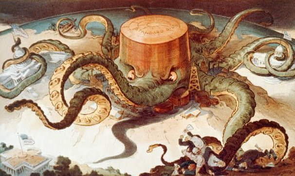

# squealing-octo-hockeypuck

We don't even know what we're doing.

## Technology

Below is a list of technologies we're using for `squealing-octo-hockeypuck`.

- Raspberry Pi
- MongoDB, Expressjs, Angular, Node.js (MEAN) stack
- [ZenHub](https://www.zenhub.io/)

## Core Features

Below is a list of milestones for the dashboard. These are intended to be
manageable chunks of work that can be done in at least a two hour span of work
among several developers. To find more information about these features, check
out the "Milestones" section in Issues. Some 

- Development Setup
  - Setup Raspberri Pi with Raspian.
  - Install MongoDB and setup.
  - Install Node.js and necessary modules (`express`, `mongoose`, etc.).
  - *ENHANCEMENT* Setup ad hoc network on the Pi.
- User management
  - Implement CRUD operations for Users.
  - Serve a web page for visitors to create a User entity.
  - Serve a web page for a user to view his or her profile (dependent on future
    work).
  - Allow users to search/view other user's profiles.
  - *ENHANCEMENT* Allow visitors to sign in annonymously.
  - *ENHANCEMENT* Generate random names for annonymous users.
  - *ENHANCEMENT* Implement functionality to allow users to recover lost passwords.
  - *ENHANCEMENT* Setup Gravatar so a personalized avatar can be used on the
    profile page.
- Match management
  - Create collections/tables for Matches and Records.
  - Implement CRUD operations for Match and Record entities.
  - Serve a web page to allow users to interact with Match operations
- Bracket generation
  - Create/use an external an algorithm to generate brackets.
  - Serve a web page to display and manage a bracket.
  - *ENHANCEMENT* Use different functions to generate different brackets based
    on a certain criteria.
  - *ENHANCEMENT* When a bracket is generated, end registration for a
    tournament and open up new registration.
- Tournament management
  - Create a collection/table for Tournaments.
  - Implement CRUD operations for a Tournament.
  - Serve a web page to allow users to interact with Tournament operations.
  - Serve a web page for users to sign up for a tournament.

## Enhancements

The list above of features provide core functionality for
`squealting-octo-hockeypuck`, but basic functionality is never fun. The list
below are things that didn't seem to quite fit in to one of the categories
above but would we be "nice to haves". Some of these may appear smaller than
they actually are, there is no guarantee that one bullet point may or may not
be a giant time suck.

- Setup notifications (new tournament scheduled, upcoming tournaments,
  callouts, etc.).
- Allow one user to challenge another user.
- Assign titles to users based on the tournament record and outcome.
  - Titles appear on the user's profile page.
  - Titles can change from week-to-week based on a tournament.
- Assign achievements based on criteria.
  - Achievements are persistent, once earned, they do not go away.
  - Achievements are displayed on a user's profile page.
- Implement a voting system.
- Implement a calendar to allow for future tournaments to be scheduled and
  signed up for.
- Calculate handicaps based on user's win/loss record.
- Create a feed on the home page with upcoming/current events.
- Implement quick setup scripts, so this may be run on a variety of physical or
  cloud based hosts.
- Integrate with the DevEcoDashboard Slack channel.
- Create taunts or other interactions between users.
- Create analytics to track adaptation, usage, etc.

## Schemas
Question marks (?) denote a boolean value.
Brackets ([]) denote an array of values.
Braces ({}) denote a key value-map.

- User
  - Data: [Name, Nickname, Title, Achievement, UUID]
  - Has: {Game Character - Times played}
- Game Character
  - Data: [Name, UUID]
- Tournament Event
  - Data: [Date, Winner, User, Voting, Bracket, UUID, Game UUID, Team?, Challenge?]
  - Has: [Match]
  - Part of: [Calendar]
- Match
  - Data: [User, User, Game Character, Game Character, Winner, Loser, UUID, Time]
- Calendar
  - Has: [Tournament Event, Location]
- Game
  - Data: [Title, Game Character, Description, URL, UUID]
- Record
  - Data: [User.UUID, Game.Title, Character.UUID, Wins, Losses]
